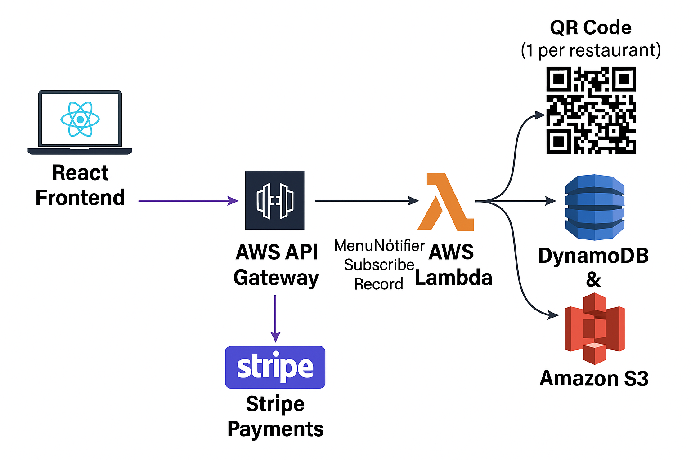

# 🍽️ MenuNotifier — Smart Restaurant Menu Notification System

www.menu-notifier.com

## 🚀 Overview
**MenuNotifier** is a cloud-based web application that enables restaurant owners to instantly update and notify their customers about new menu items, offers, or changes — all through a simple dashboard.

When a restaurant subscribes to a plan and completes payment, the system automatically generates a **unique QR code** for that restaurant. Customers can scan the QR to subscribe for updates and stay informed about menu changes in real time.

---

## 🧩 Problem Statement
Restaurants frequently change their menus, launch new dishes, or run limited-time offers — but customers rarely get notified in time.  
Existing systems are either manual (e.g., social media posts) or expensive subscription tools.

**MenuNotifier** solves this by:
- Giving each restaurant a **personalized QR code** to connect with customers.
- Enabling restaurants to **send notifications directly** to subscribers.
- Allowing restaurants to **manage menus easily** via a cloud dashboard.

---

## 💡 Solution Summary
1. A restaurant signs up and purchases a plan using Stripe payments.  
2. Upon successful payment:
   - A **QR code** is automatically generated (only once per restaurant).
   - The QR image is stored in **AWS S3**.
   - The QR URL is stored in **AWS DynamoDB** for later retrieval.
3. The restaurant can log in anytime to:
   - View its dashboard.
   - Download or display its QR code.
   - Manage its menu notifications.

---

## 🏗️ System Architecture

React Frontend → AWS API Gateway → AWS Lambda → DynamoDB & S3
↑
│
Stripe Payments

**Frontend** hosted on **Amazon S3** (static website hosting) and served via **CloudFront** CDN for performance and SSL.

---

## 🛠️ Tech Stack

### 🌐 Frontend
- **React JS** (SPA for Dashboard & Packages flow)
- **Stripe JS** for secure payment checkout
- **Tailwind CSS** for UI styling
- **Deployed on AWS S3 + CloudFront**

### ⚙️ Backend
- **AWS Lambda** for serverless compute
- **AWS API Gateway** as REST API layer
- **Stripe Node SDK** inside Lambda for payments
- **qrcode npm package** for QR generation
- **AWS SDK v3** for S3 & DynamoDB interactions

### ☁️ Cloud & Storage
- **Amazon S3** → hosts website and stores QR images  
- **Amazon DynamoDB** → stores restaurant data and QR code URLs  
- **AWS IAM Roles & Policies** → secure function access  
- **CloudWatch** → logging and monitoring

---

## 🔄 Application Flow

1. **User Signup & Payment**
   - User selects a plan and completes payment via Stripe.
   - Lambda (`createPaymentIntent`) creates a Stripe PaymentIntent.
   - On success, the backend stores subscription data in DynamoDB.

2. **QR Code Generation**
   - `generateQRCode` Lambda checks if a QR code already exists.
   - If not, generates a QR linking customers to the restaurant’s subscription page.
   - The QR image is uploaded to S3 and its URL saved in DynamoDB.

3. **QR Code Retrieval**
   - `getQRCode` Lambda fetches the QR URL from DynamoDB.
   - The React app displays the image and provides a download option.

---

## 💻 Features
✅ Secure Stripe Payment Integration  
✅ Automatic QR Code Generation (one per restaurant)  
✅ Cloud-native Serverless Backend (AWS Lambda + DynamoDB)  
✅ React-based Frontend Hosted on S3 + CloudFront  
✅ Real-time Subscription Tracking  
✅ Downloadable Restaurant QR Code  
✅ Scalable, Cost-efficient Architecture  

---

---

## 🧾 Example Workflow
1. User visits **MenuNotifier.com**
2. Chooses **“Pro Plan”**
3. Completes payment through **Stripe**
4. Backend creates a record and generates a **QR code**
5. The restaurant accesses the **Dashboard** → *“See My QR Code”*
6. The same QR is reused forever for that restaurant

---

## 🔒 Security & Permissions
- Each Lambda has fine-grained **IAM policies** (S3 Get/Put & DynamoDB Get/PutItem).  
- Cross-origin resource sharing (CORS) enabled for API Gateway.  
- S3 buckets use **private ACLs** and only serve images via HTTPS URLs.  

---

## 🚀 Deployment Highlights
| Component | Hosting/Service | Deployment Method |
|------------|----------------|-------------------|
| Frontend | **AWS S3 + CloudFront** | Manual upload or automated build |
| Backend APIs | **AWS Lambda + API Gateway** | Deployed via AWS Console or CLI |
| Database | **DynamoDB** | Serverless NoSQL |
| Media | **S3 Bucket** | Private objects with public HTTPS URLs |

---

## 📈 Future Enhancements
- Add **email / WhatsApp** push notifications for subscribers  
- Add **multi-branch support** for restaurant chains  
- Integrate **AWS SNS** for scalable notifications  
- Automate full CI/CD with **GitHub Actions → Lambda Deployments**
-Online menu and order placing system

---

## 👨‍💻 Author
**Prashanth Devarapalli**  
AWS & Azure Certified DevOps Engineer | DevOps Engineer and Web Development Enthusiast
📍 United States

---

✨ *A cloud-first, serverless solution empowering restaurants to connect directly with their customers.*

